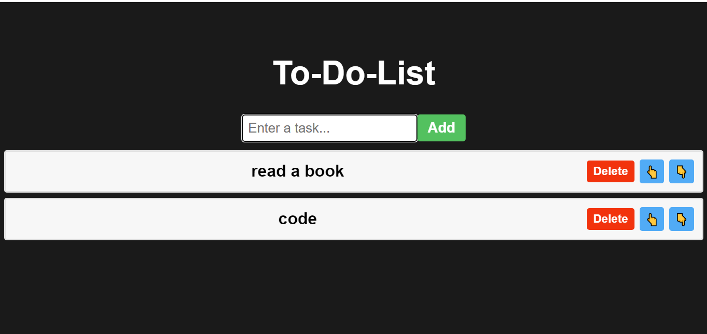

# To-Do App 📝

A simple and interactive **To-Do List Application** built with **React.js**, featuring task addition, deletion, and reordering. This project serves as a practice for React state management and UI interactivity.

---

## Table of Contents

1. [Screenshot](#screenshot)
2. [Features](#features)
3. [Technologies Used](#technologies-used)
4. [Setup Instructions](#setup-instructions)
5. [Usage](#usage)

---

## Screenshot


[View the live project here!](https://laibatariq110.github.io/TO-DO-APP)

---

## Features

- **Add Tasks**: Easily add tasks to your to-do list.
- **Delete Tasks**: Remove completed or unnecessary tasks.
- **Reorder Tasks**: Move tasks up or down in the list to prioritize.
- **Interactive Design**: Provides a clean and responsive user interface.

---

## Technologies Used

- **React.js**: Component-based front-end framework.
- **JavaScript**: For dynamic behavior.
- **CSS**: For styling the app interface.
- **Vite**: Development build tool for fast performance.

---

## Setup Instructions

1. **Clone the repository**:
   ```bash
   git clone https://github.com/laibatariq110/TO-DO-APP.git
   ```
2. Navigate to the project directory:
   ```bash
   cd TO-DO-APP
   ```
3. Install the dependencies:
   ```bash
   npm install
   ```
4. Start the development server:
   ```bash
   npm run dev
   ```
## Usage

- Enter a task in the input box and click the **Add** button to add it to the list.
- Use the **Delete** button to remove tasks from the list.
- Click the **👆** or **👇** buttons to move tasks up or down in the list.
